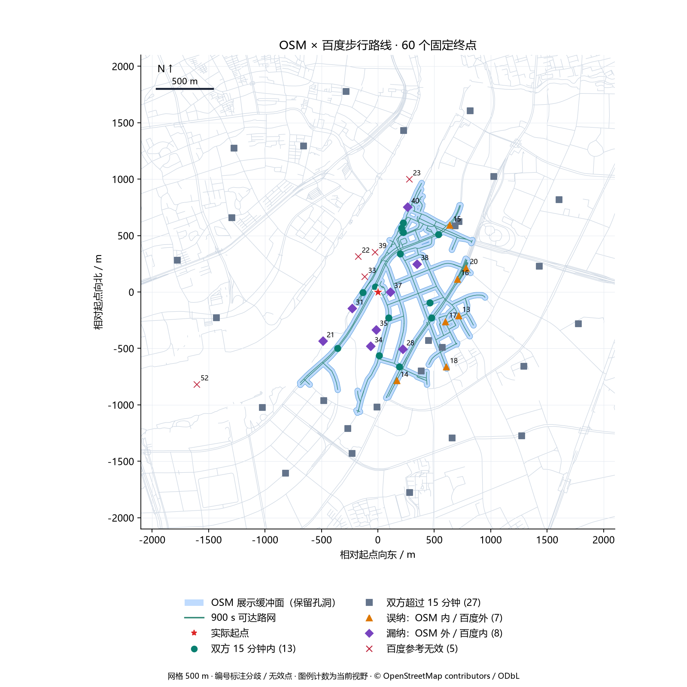
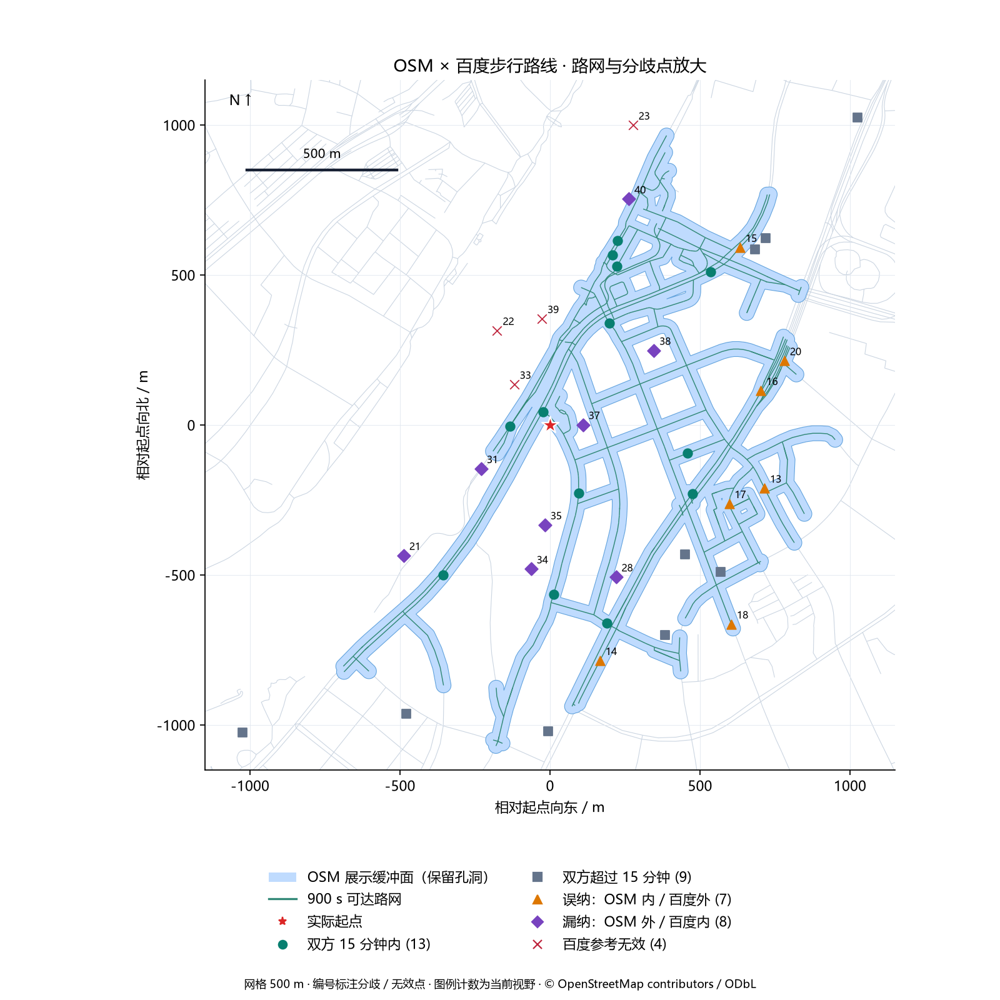
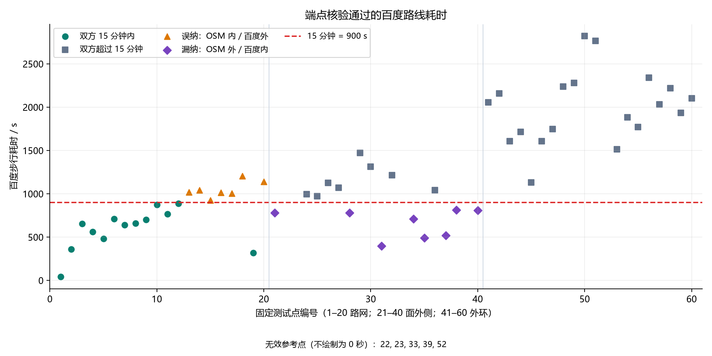
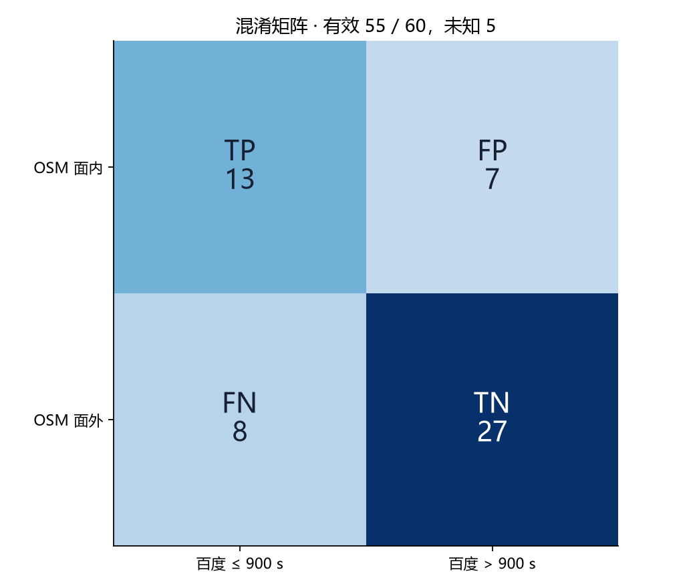

# OSM_OFFLINE：百度 API 测试与验收报告

## 验收结论

真实调用完成；对照覆盖门槛通过。固定 60 个起终点对（1 个起点、60 个终点），HTTP 200／百度状态 0 为 60/60，严格端点核验有效 55/60；未知 5/60。
有效共同参考集上一致率 72.73%，误纳率 35.00%，漏纳率 38.10%，F1 63.41%。本轮没有预先约定精度通过线，因此不把调用成功或 quality=usable 写成算法精度验收通过。

## 现状与变更范围

上轮 60 次调用没有任何 HTTP 响应。本轮另建一次性运行记录，保留旧轮失败事实，不复用或补造百度标签。上轮通过单次诊断回填所有点为 ConnectError 的做法不作为逐点原始证据。
本轮仅修复测试工具与报告：冻结请求坐标、严格核验两端点、逐点持久化、故障停止、防止重复发送、修正 FP/FN 图示位置和 F1=0 的显示；绘图保留孔洞、图例仅显示实际类别，并标注 500 m 网格及比例尺。算法、生产 Provider、步速和缓冲参数没有修改。

## 执行前固定方案与评价口径

起点 BD09LL (121.511080,31.204150)，15 分钟=900 秒；步速 1.3 m/s，展示缓冲半径 25 m。OSM 数据 geofabrik-shanghai-20260912，度量坐标 EPSG:32651，所有请求坐标归一化至六位小数。
沿用上轮 60 个终点：20 个可达路网点、20 个缓冲面外侧点、20 个外环点。点集在获取本轮百度结果前冻结；不按结果补点或调整参数。外侧点来自缓冲面边界（含孔洞），不等于 900 秒路由截止边界；点集依赖 OSM 输出，不是全城随机独立抽样。
每点最多一次请求，预算上限 60、无重试、实际并发 1；上一次响应后等待至少 510 ms，QPS 上限 2。鉴权、配额、限流、参数、HTTP 或连接故障停止后续请求；本地写入失败也停止。
百度有效要求：HTTP 200、状态 0、耗时有效、起终点完整且距请求位置均不超过 50 m。有效且耗时 ≤900 秒为参考可达。未通过端点核验的数值只用于诊断，不加入混淆矩阵。
OSM 判定使用确切请求坐标是否位于 25 m 展示缓冲面中。这验证面覆盖与百度路线标签的一致性，不是逐点 OSM 最短路径耗时误差；缓冲面本身不计目的端离路接入时间。
误纳率=FP/(TP+FP)，漏纳率=FN/(TP+FN)，unknown=无有效百度参考/全部 60 点。零分母记为未评估。有效参考门槛：至少 50 点，百度可达、不可达各不少于 10 点。无真实面积 IoU、边界 P95 或全城推广结论。

## 真实执行记录

北京时间 2026-09-14T13:39:45+08:00 至 2026-09-14T13:40:26+08:00；端到端采集耗时 40.711 秒，不含本地缓存加载和绘图。

| 指标 | 实测 |
| --- | ---: |
| 固定点／尝试／HTTP 响应 | 60 / 60 / 60 |
| HTTP 200 且百度状态 0 | 60 |
| 严格有效／无效或未发送 | 55 / 5 |
| 重试／最大在途 | 0 / 1 |
| 滚动一秒最多发起 | 2 |
| 最短发起间隔 / s | 0.6047 |
| HTTP 响应中位数／P95 / ms | 94.79 / 277.21 |
| OSM 单次计算 / ms | 577.53 |

错误／参考无效原因：{"ok": 55, "endpoint_offset": 5}。

## 测验与对照结果

| 分组 | 总点数 | 有效 | TP | TN | FP | FN | 一致率 | 误纳率 | 漏纳率 |
| --- | ---: | ---: | ---: | ---: | ---: | ---: | ---: | ---: | ---: |
| 全部 | 60 | 55 | 13 | 27 | 7 | 8 | 72.73% | 35.00% | 38.10% |
| 可达路网点 | 20 | 20 | 13 | 0 | 7 | 0 | 65.00% | 35.00% | 0.00% |
| 缓冲面外侧点 | 20 | 16 | 0 | 8 | 0 | 8 | 50.00% | 未评估 | 100.00% |
| 外环点 | 20 | 19 | 0 | 19 | 0 | 0 | 100.00% | 未评估 | 未评估 |

## 可视化样例

## 分歧与无效参考逐点复核

| 编号／点 ID | 结论 | 百度耗时 / s | 起点偏移 / m | 终点偏移 / m | 至 OSM 可达路网 / m |
| --- | --- | ---: | ---: | ---: | ---: |
| 13 / road-13 | 误纳：OSM 内／百度外 / ok | 1018.0 | 1.1 | 2.6 | 0.0 |
| 14 / road-14 | 误纳：OSM 内／百度外 / ok | 1043.0 | 1.1 | 5.8 | 0.1 |
| 15 / road-15 | 误纳：OSM 内／百度外 / ok | 923.0 | 1.1 | 1.4 | 0.1 |
| 16 / road-16 | 误纳：OSM 内／百度外 / ok | 1013.0 | 1.1 | 4.2 | 0.1 |
| 17 / road-17 | 误纳：OSM 内／百度外 / ok | 1006.0 | 1.1 | 0.9 | 0.1 |
| 18 / road-18 | 误纳：OSM 内／百度外 / ok | 1203.0 | 1.1 | 1.7 | 0.1 |
| 20 / road-20 | 误纳：OSM 内／百度外 / ok | 1142.0 | 1.1 | 6.8 | 0.1 |
| 21 / boundary-01 | 漏纳：OSM 外／百度内 / ok | 782.0 | 1.1 | 22.6 | 130.9 |
| 22 / boundary-02 | 百度参考无效 / endpoint_offset | 280.0 | 1.1 | 203.0 | 202.2 |
| 23 / boundary-03 | 百度参考无效 / endpoint_offset | 968.0 | 1.1 | 111.1 | 114.9 |
| 28 / boundary-08 | 漏纳：OSM 外／百度内 / ok | 782.0 | 1.1 | 0.3 | 35.5 |
| 31 / boundary-11 | 漏纳：OSM 外／百度内 / ok | 399.0 | 1.1 | 11.7 | 70.2 |
| 33 / boundary-13 | 百度参考无效 / endpoint_offset | 224.0 | 1.1 | 71.5 | 63.6 |
| 34 / boundary-14 | 漏纳：OSM 外／百度内 / ok | 709.0 | 1.1 | 6.0 | 96.0 |
| 35 / boundary-15 | 漏纳：OSM 外／百度内 / ok | 490.0 | 1.1 | 40.8 | 89.2 |
| 37 / boundary-17 | 漏纳：OSM 外／百度内 / ok | 517.0 | 1.1 | 6.3 | 42.9 |
| 38 / boundary-18 | 漏纳：OSM 外／百度内 / ok | 813.0 | 1.1 | 17.3 | 68.0 |
| 39 / boundary-19 | 百度参考无效 / endpoint_offset | 344.0 | 1.1 | 84.4 | 87.4 |
| 40 / boundary-20 | 漏纳：OSM 外／百度内 / ok | 807.0 | 1.1 | 9.0 | 25.4 |
| 52 / ring-12 | 百度参考无效 / endpoint_offset | 3335.0 | 1.1 | 230.2 | 914.9 |

上述位置差与耗时是观测证据；道路缺失、通行规则、地图版本和步速差异仍是可能解释，未通过现场调查确认。百度返回的最短候选端点偏移大于 50 m 时，本轮保留为无效参考，不能用其耗时判定算法出错。

## 自动化回归与复现

| 范围／证据 | 用例 | 失败 | 跳过 |
| --- | ---: | ---: | ---: |
| backend-tests.xml | 355 | 0 | 1 |
| validation-tests.xml | 11 | 0 | 0 |

完整后端回归 354 通过、1 跳过，含新增工具测试中的 10 项；追加孔洞绘图断言后，专项复测 11 项全部通过。两组存在重复，不相加报告。完整回归有 2 条既有 Starlette/AnyIO 弃用提示。
从 backend 目录执行：.venv/Scripts/python.exe scripts/validate_osm_baidu.py --render
重绘命令不读取密钥、不调用 API。实际采集命令为同脚本 --execute-live；同目录存在 live-started.json 时拒绝再次执行。新采集必须使用新的冻结计划与输出目录。

## 产物、交接与限制

report.html 为浏览器版；TEST_REPORT.md 为团队交接版；cases.csv 为完整 60 点明细；plan.json 为固定计划；run.json 为逐点实测；metrics.json 为汇总；geometry.json 为复现绘图所需的本地 OSM 几何；manifest.json 为交付哈希。
算法基线提交：0fde537e78ccb4fe9e72a3c85c89906b1b19903c；点集计划 SHA256：767f1fba58de54e3b4f296e909c41f0f07f7c5a6d7c590053087332541d205bc；缓存 SHA256：43e2ec797447cad45ed962a2dffe3030e188a5618f90e0dfb9d82e8d472994e1。
百度接口 /directionlite/v1/walking，coord_type=bd09ll，ret_coordtype=bd09ll，steps_info=1。AK 仅从本地受保护配置读取，导出不含请求 URL、原始响应或原始异常。
本次为一个上海起点的 60 对路线验证，不是 60 个独立生活圈；结果受 OSM 条件抽样与百度端点吸附影响，不外推为全上海准确率。
此前零响应百度报告及空图已由本轮交付替代并清理；此前独立离线算法报告包含有用测试证据，继续保留。

## 结果解释与后续工作

本轮没有依据证明存在“秒／分钟”或“米／千米”混用。计算阈值固定为 900 秒，绘图使用米制投影；差异主要需要从耗时模型和覆盖面定义进一步核查。

7 个误纳均来自路网组（road-13、14、15、16、17、18、20），百度耗时为 923–1203 秒。其中 5 条百度路线的距离若仅按 OSM 固定步速 1.3 m/s 换算，会落在 900 秒内；另 2 条仍超过 900 秒。这个事后诊断说明耗时口径能解释部分差异，但不能证明 OSM 路径与百度路径相同，也不能据此修改本轮判定或宣称校准成功。

8 个漏纳均来自缓冲面外侧组，百度耗时为 399–813 秒，距离 OSM 可达路网约 25.43–130.87 米。boundary-20 距路网 25.43 米，仅比 25 米缓冲半径多约 0.43 米，是对绘图面宽度很敏感的个例；boundary-17 距可达路网 42.87 米，百度耗时 517 秒，提示“窄路网缓冲面”不能直接代表所有可步行到达的地块或入口。其余差异仍需结合完整道路连通性、入口与通行约束核验。

5 个无效参考的百度返回终点偏移约 71.53–230.17 米，编号为 22、23、33、39、52。虽然 HTTP 和百度业务状态都成功，但路线没有到达足够接近请求终点的位置；排除这些样本可避免把百度吸附带来的偏移误记为 OSM 算法错误。

接口实测已完成，算法与百度仍存在明显分歧。后续应先明确交付对象是“15 分钟内可达的道路集合”还是“包含目的端接入的生活圈区域”，再增加跨起点、与算法输出无关的固定参考集，并分别核查路网与时间模型。调整步速、缓冲宽度或接入规则后需要新的独立验证，不能用本轮样本调参后再把同一批点作为独立精度证明。

